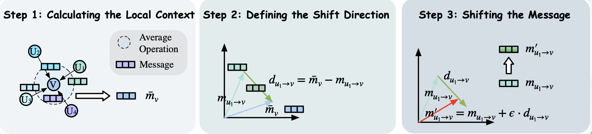

# Weigang Lu's Academic Homepage

基于 [WowPage](https://github.com/wd7ang/WowPage) 模板构建的学术主页。

**在线访问**: https://weiganglu.github.io/HomePage/

---

## 📁 项目结构

```
HomePage/
├── _config.yml              # 网站配置和个人信息
├── _pages/
│   └── about.md             # 主页内容（News, Experience, Publications等）
├── _data/
│   └── navigation.yml       # 导航菜单配置
├── _includes/               # 页面组件（不要修改）
├── _layouts/                # 页面布局（不要修改）
├── _sass/                   # 样式文件（不要修改）
├── assets/
│   ├── css/                 # 样式表
│   ├── js/                  # JavaScript 文件
│   ├── fonts/               # 字体文件
│   └── webfonts/            # Web 字体
├── images/                  # 所有图片
│   ├── you.jpg              # 头像照片
│   ├── education/           # 学校 logo
│   └── *.png/pdf            # 论文图片
├── Gemfile                  # Ruby 依赖
└── README.md                # 本文件
```

---

## 🚀 快速开始

### 本地预览

```bash
# 安装依赖
bundle install

# 启动本地服务器
bundle exec jekyll serve

# 访问 http://localhost:4000
```

### 部署到 GitHub Pages

1. 推送到 GitHub
2. 进入仓库 Settings → Pages
3. Source 选择 "Deploy from a branch"
4. Branch 选择 "master/root" 和 "/ (root)"
5. 等待 1-2 分钟，访问 https://<username>.github.io/<repo>/

---

## 📝 如何修改内容

### 1. 修改个人信息

**文件**: `_config.yml`

```yaml
# 基本信息
title: "Weigang Lu"                    # 网站标题
name: "Weigang Lu"                     # 您的姓名
description: "您的简介"                 # 网站描述
url: "https://weiganglu.github.io"     # 您的 GitHub Pages URL
baseurl: "/HomePage"                   # 仓库名称（如果是用户名.github.io则留空）
repository: "weiganglu/HomePage"       # GitHub 仓库

# 作者信息
author:
  avatar: "you.jpg"                    # 头像文件（在 images/ 目录中）
  name: "Weigang Lu"                   # 姓名
  pronouns: "he/his"                   # 代词
  bio: "您的详细简介..."                # 个人简介
  location: "Hong Kong, China"         # 位置
  employer: "HKUST"                    # 雇主/学校
  email: "your.email@example.com"      # 邮箱
  
  # 学术链接
  googlescholar: "https://scholar.google.com/..."  # Google Scholar
  arxiv: "https://arxiv.org/..."                    # arXiv
  orcid: "https://orcid.org/..."                    # ORCID
  
  # 社交媒体（可选）
  github: "your-github-username"
  linkedin: "your-linkedin-username"
  twitter: "your-twitter-username"
```

**修改步骤**:
1. 打开 `_config.yml`
2. 修改对应的字段值
3. 保存文件
4. 提交并推送到 GitHub

---

### 2. 修改主页内容

**文件**: `_pages/about.md`

这是主要的内容文件，包含所有 section：News, Experience, Publications, Awards, Services。

#### 2.1 修改 News（新闻动态）

找到 News section：

```markdown
News
---------------
<div class="news-box">
  <ul class="news-list">

<li><span class="news-date"><em>2026.01</em></span> 🎉🎉 One paper accepted at <strong>WWW 2026</strong>!</li>
<li><span class="news-date"><em>2025.12</em></span> 🏆🏆 Received <strong>National Scholarship</strong>!</li>

  </ul>
</div>
```

**添加新 News**:
```markdown
<li><span class="news-date"><em>2026.03</em></span> 🎉🎉 您的新动态！</li>
```

**格式说明**:
- `news-date`: 日期（格式：YYYY.MM）
- 使用 emoji 增加视觉效果：🎉（论文接收）、🏆（获奖）、🎓（毕业）、📢（演讲）
- 使用 `<strong>` 加粗重要内容

**建议**: 最新的 news 放在最上面

---

#### 2.2 修改 Experience（经历）

找到 Experience section：

```markdown
Experience
--------------

<div class="experience-container">

  <div class="experience-card">
      
      <div class="experience-info">
          <strong>Hong Kong University of Science and Technology</strong><br>
          <em>2025 - Present</em><br>
          Postdoctoral Fellow at <a href="https://www.hkust.edu.hk/"><em>Department of Civil and Environmental Engineering</em></a><br>
          <span style="color:#888;">Research on semi-supervised learning.</span>
      </div>
  </div>

</div>
```

**添加新经历**:
```markdown
<div class="experience-card">
    
    <div class="experience-info">
        <strong>公司/学校名称</strong><br>
        <em>开始时间 - 结束时间</em><br>
        职位，advisor: <a href="链接"><em>导师姓名</em></a><br>
        <span style="color:#888;">简短描述。</span>
    </div>
</div>
```

**字段说明**:
- `img src`: logo 图片路径（放在 `images/` 目录）
- `strong`: 机构名称
- `em`: 时间段
- 第三行：职位和导师（可选）
- `span`: 灰色描述文字（可选）

---

#### 2.3 修改 Publications（论文）

论文分为两部分：**Highlighted Publications**（精选，带图片）和 **Full Publications List**（完整列表）。

##### 2.3.1 修改 Highlighted Publications（精选论文卡片）

```markdown
<div class="publication-card" data-category="all"> 
  <div style="display: flex; align-items: center;">
    <div class="pub-media-rotator" style="position: relative; width: 320px; height: 180px; margin-right: 20px; border-radius: 8px; overflow: hidden; flex: 0 0 auto;"> 
       
    </div> 
    <div>
      <strong>论文标题</strong><br>
      <i style="font-size: 13px;">
        <strong>作者1</strong>, 作者2, 作者3.
      </i><br> 
      论文简介（1-2句话）。
      <br> 
      <b><i style="color:#83a1c7;">会议/期刊 年份 &nbsp;</i></b> 
      <a href="论文链接"><em>[Paper]</em></a>
      <a href="代码链接"><em>[Code]</em></a>
    </div>
  </div> 
</div>
```

**修改步骤**:
1. 复制上面的模板
2. 替换论文信息：
   - `img src`: 论文图片（放在 `images/` 目录）
   - `strong`: 论文标题
   - `i`: 作者列表（用 `<strong>` 加粗自己的名字）
   - 论文简介
   - 会议/期刊名称
   - 链接

**建议**: 选择 3-5 篇代表性论文作为 Highlighted

##### 2.3.2 修改 Full Publications List（完整论文列表）

```markdown
<div id="full-publications" class="publication-view" data-publication-view="list" hidden>
  <ul class="full-publication-list">
    <li>
      <span class="pub-list-badge">WWW 2026</span>
      <span class="pub-list-title">论文标题</span><br>
      <span class="pub-list-authors">
        <strong>Weigang Lu</strong>, 作者2, 作者3.
      </span>
      <span class="pub-list-note">Oral.</span>
      <span class="pub-list-links"><a href="链接">[Paper]</a></span>
    </li>
  </ul>
</div>
```

**添加新论文**:
```markdown
<li>
  <span class="pub-list-badge">会议/期刊 年份</span>
  <span class="pub-list-title">论文标题</span><br>
  <span class="pub-list-authors">
    <strong>您的名字</strong>, 其他作者.
  </span>
  <span class="pub-list-note">Oral/Spotlight.（可选）</span>
  <span class="pub-list-links">
    <a href="论文链接">[Paper]</a>
    <a href="代码链接">[Code]</a>
    <a href="arXiv链接">[arXiv]</a>
  </span>
</li>
```

**字段说明**:
- `pub-list-badge`: 会议/期刊名称（显示为标签）
- `pub-list-title`: 论文标题
- `pub-list-authors`: 作者列表（加粗自己的名字）
- `pub-list-note`: 特殊标注（Oral, Spotlight 等，可选）
- `pub-list-links`: 链接按钮

---

#### 2.4 修改 Awards（荣誉）

```markdown
Awards
--------
- 🏆 *2025*, AAAI Student Travel Award
- 🏆 *2024*, National Scholarship for Postgraduates
```

**添加新奖项**:
```markdown
- 🏆 *年份*, 奖项名称
```

**格式**:
- 使用 emoji 🏆
- `*年份*`: 斜体年份
- 奖项名称

---

#### 2.5 修改 Services（学术服务）

```markdown
Services
--------

**Journal Reviewer:**
- IEEE Transactions on Knowledge and Data Engineering (TKDE)
- IEEE Transactions on Neural Networks and Learning Systems (TNNLS)

**Conference Reviewer:**
- AAAI 2026
- NeurIPS 2026
```

**添加期刊/会议**:
```markdown
**Journal Reviewer:**
- 期刊名称 1
- 期刊名称 2

**Conference Reviewer:**
- 会议 年份
```

---

### 3. 修改导航菜单

**文件**: `_data/navigation.yml`

```yaml
main:
  - title: "News"
    url: "/#news"
  - title: "Experience"
    url: "/#experience"
  - title: "Pub"
    url: "/#publications"
  - title: "Awards"
    url: "/#awards"
  - title: "Services"
    url: "/#services"
```

**添加导航项**:
```yaml
  - title: "显示文本"
    url: "/#section-id"
```

**删除导航项**: 直接删除对应的 2 行

---

### 4. 添加图片

所有图片放在 `images/` 目录：

#### 4.1 头像照片
- 文件名: `you.jpg`（或修改 `_config.yml` 中的 `author.avatar`）
- 建议尺寸: 400x400px

#### 4.2 学校/公司 Logo
- 放在 `images/education/` 或 `images/` 目录
- 在 Experience section 中引用:
  ```html
  
  ```

#### 4.3 论文图片
- 放在 `images/` 目录
- 支持格式: PNG, JPG, PDF, SVG
- 在 Highlighted Publications 中引用:
  ```html
  
  ```

---

## 🎨 样式定制（高级）

**警告**: 修改样式需要 CSS 知识

### 修改颜色

**文件**: `assets/css/home.css` 或 `_sass/_variables.scss`

```scss
// 找到颜色变量并修改
$primary-color: #ca6f6f;  // 主色调
$accent-color: #b95f3d;   // 强调色
```

### 修改字体

**文件**: `_sass/_variables.scss`

```scss
$font-family-main: 'Arial Rounded MT Bold', 'Verdana', sans-serif;
$font-family-heading: 'Permanent Marker', cursive;
```

---

## 🔧 常见问题

### Q1: 本地预览报错 "bundle: command not found"

**解决**: 安装 Ruby 和 Bundler

```bash
# macOS
brew install ruby
gem install bundler

# Linux
sudo apt install ruby-full build-essential
gem install bundler
```

### Q2: GitHub Pages 没有更新

**解决**:
1. 检查 GitHub Actions 状态: https://github.com/username/repo/actions
2. 确认构建成功（绿色勾）
3. 强制刷新浏览器（Cmd+Shift+R 或 Ctrl+Shift+R）
4. 等待 2-3 分钟

### Q3: 图片不显示

**检查**:
1. 图片路径是否正确（区分大小写）
2. 图片文件是否存在
3. 格式是否支持（PNG, JPG, SVG, GIF）

### Q4: 论文列表切换按钮不工作

**解决**: 确保 JavaScript 文件存在
```bash
# 检查文件是否存在
ls assets/js/show_publications.js
ls assets/js/pub_media_rotator.js
```

### Q5: 修改后本地正常但 GitHub 上不正常

**解决**:
1. 提交并推送所有更改
2. 检查 GitHub Actions 构建状态
3. 清除浏览器缓存
4. 使用无痕模式访问

---

## 📊 内容更新清单

定期更新以下内容：

- [ ] **News**: 添加新的论文接收、获奖、演讲信息
- [ ] **Publications**: 添加新发表的论文
- [ ] **Experience**: 更新当前职位
- [ ] **Awards**: 添加新获得的奖项
- [ ] **Services**: 更新审稿记录
- [ ] **Profile**: 更新头像、简介

---

## 🚀 部署流程

### 首次部署

```bash
# 1. 创建 GitHub 仓库
# 访问 https://github.com/new

# 2. 初始化并推送
git init
git add .
git commit -m "Initial commit"
git branch -M main
git remote add origin https://github.com/username/repo.git
git push -u origin main

# 3. 启用 GitHub Pages
# Settings → Pages → Source: Deploy from a branch
# Branch: main / root
```

### 日常更新

```bash
# 修改文件后
git add .
git commit -m "Update: 描述您的更改"
git push
```

GitHub Pages 会自动重新构建（1-2 分钟）。

---

## 📚 参考资源

- [WowPage 原始模板](https://github.com/wd7ang/WowPage)
- [Jekyll 官方文档](https://jekyllrb.com/docs/)
- [GitHub Pages 文档](https://docs.github.com/en/pages)
- [Markdown 语法指南](https://www.markdownguide.org/)

---

## 🤝 贡献

发现错误或想要改进？欢迎：
1. 提交 Issue
2. 提交 Pull Request

---

## 📧 联系方式

- **Email**: weiganglu314@outlook.com
- **Google Scholar**: [Weigang Lu](https://scholar.google.com/citations?user=SThY8qUAAAAJ&hl=en)
- **GitHub**: [@WeigangLu](https://github.com/WeigangLu)

---

## 📄 许可证

本主页基于 [WowPage](https://github.com/wd7ang/WowPage) 模板，遵循原模板的许可证。

---

**最后更新**: 2026-01
